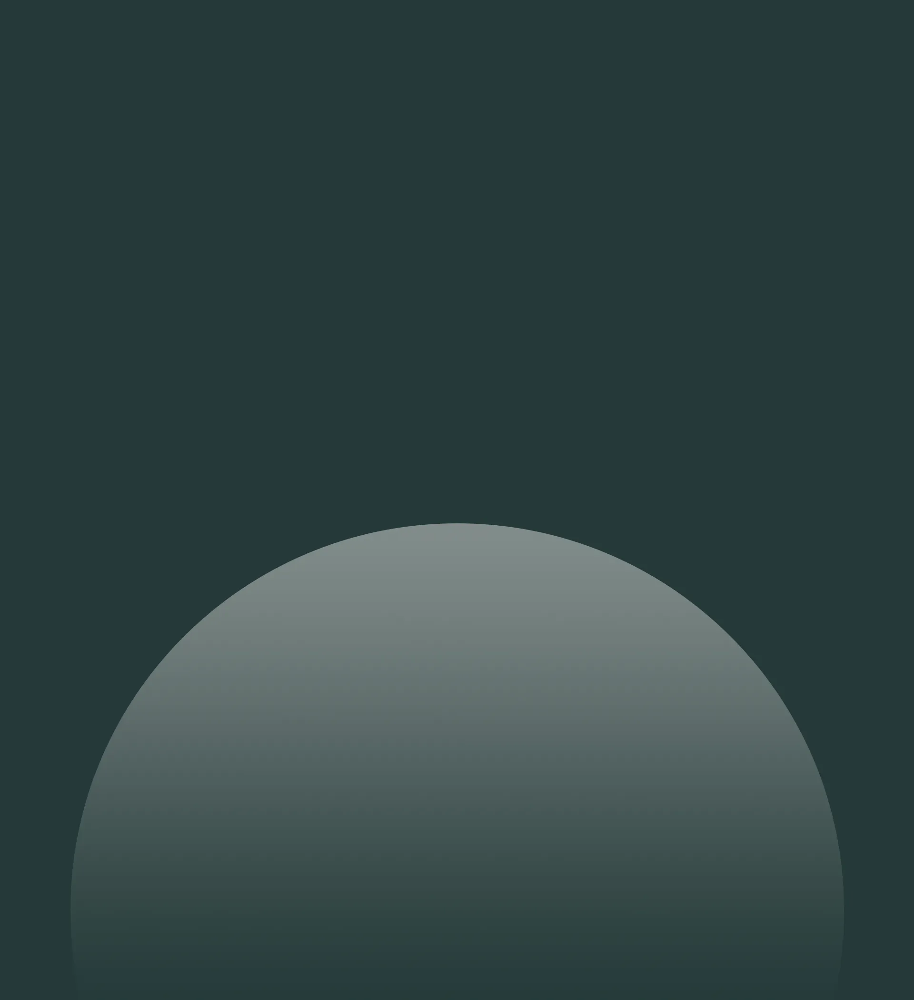

<footer>
                    

                    

                    <h1>Let's Talk</h1>
                    <h1>About the Next</h1>
                    <h1>big thing</h1>
                    <svg
                        class="o-ui-arrow"
                        width="64"
                        height="64"
                        viewBox="0 0 64 64"
                        fill="none"
                        xmlns="http://www.w3.org/2000/svg"
                    >
                        <path
                        d="M3.10162 3.10156L62.9999 62.9999"
                        stroke-linecap="round"
                        stroke-linejoin="round"
                        ></path>
                        <path
                        d="M63 1.00001L63 63L0.999989 63"
                        stroke-linecap="round"
                        stroke-linejoin="round"
                        ></path>
                    </svg>
                    

        
                    

                    <button>
                        <h4>Write a Message</h4>
                    </button>
                    <button>
                        <h4>Discuss Project</h4>
                    </button>
                    

        
                    

                    

                        

                        <h3>Behance</h3>
                        <h5>@abhishek_jha</h5>
                        

                        
                    

                    

                        

                        <h3>Instagram</h3>
                        <h5>@design_flavorist</h5>
                        

                        
                    

                    

                        

                        <h3>Twitter</h3>
                        <h5>@design_flavorist</h5>
                        

                        
                    

                    

                        

                        <h3>Dribble</h3>
                        <h5>@abhishek_jha</h5>
                        

                        
                    

                    

        
                    

                    <h5>
                        &copy;2025 Abhishek Jha, All rights reserved •
                        <a href="#">Credits</a>
                    </h5>
                    <a href="#">2020 Portfolio</a>
                    

        
                </footer>

                footer {
      position: relative;
      width: 100%;
      height: 83vw;
      padding: 0 4.5vw;
      // background-color: #263939;
      background-color: red;
      // background-image: url(./fbottom.webp);
      background-position: center;
      background-size: cover;
      display: flex;
      flex-direction: column;
      gap: 9vw;
      overflow: hidden;

      .heading {
        display: flex;
        flex-direction: column;
        // background-color: red;
        align-items: center;
        position: relative;
        z-index: 1;
        margin-top: 12vw;

        h1 {
          font-size: 6.7vw;
          line-height: 5.5vw;
          font-weight: 200;
          text-transform: uppercase;
          color: white;
        }
        .o-ui-arrow {
          @include arrowSvg();
          position: absolute;
          bottom: 0;
          left: 0;
        }
      }

      .buttons {
        width: 100%;
        display: flex;
        align-items: center;
        justify-content: space-between;
        position: relative;
        z-index: 1;

        button {
          width: 48%;
          border: 1px solid white;
          background-color: transparent;
          border-radius: 100px;
          padding: 3vw 0;
          position: relative;
          overflow: hidden;

          h4 {
            font-size: 1.8vw;
            color: white;
            position: relative;
            z-index: 5;
            transition: 0.3s all cubic-bezier(0.19, 1, 0.22, 1);
          }

          &::after {
            content: "";
            z-index: 4;
            background-color: white;
            height: 100%;
            width: 75%;
            opacity: 0;
            position: absolute;
            top: 50%;
            left: 50%;
            border-radius: 100px;
            transform: translate(-50%, -50%);
            transition: 0.3s all cubic-bezier(0.19, 1, 0.22, 1);
          }

          &:hover h4 {
            color: black;
          }

          &:hover::after {
            opacity: 1;
            width: 100%;
          }

          &:hover {
            border: none;
          }
        }
      }

      .social {
        width: 100%;
        display: flex;
        justify-content: space-between;
        position: relative;
        z-index: 1;

        .media-sec {
          width: 20%;
          display: flex;
          justify-content: space-between;
          border-top: 1px solid white;
          color: white;
          padding: 1vw 0;
          transition: all linear 0.15s;
          position: relative;
          cursor: pointer;

          .head {
            position: relative;
            z-index: 5;

            h3 {
              font-size: 1.75vw;
              font-weight: 100;
            }

            h5 {
              font-size: 0.9vw;
              font-weight: 100;
              opacity: 0.6;
            }
          }

          img {
            position: relative;
            z-index: 5;
          }

          &::after {
            content: "";
            background-color: #14cf92;
            position: absolute;
            z-index: 4;
            top: 0;
            left: 0;
            height: 0%;
            width: 100%;
            transition: all linear 0.15s;
          }

          &:hover::after {
            height: 100%;
          }

          &:hover {
            padding: 1vw;
          }
        }
      }

      .f-bottom {
        width: 100%;
        display: flex;
        justify-content: space-between;
        color: white;
        position: relative;
        z-index: 4;

        h5 {
          font-size: 0.9vw;
          opacity: 0.4;

          a {
            font-size: 1vw;
            color: white;
            opacity: 1;
          }
        }

        a {
          font-size: 1vw;
          color: white;
          opacity: 0.4;
        }
      }

      #fbottom {
        position: absolute;
        width: 100%;
        height: 80%;
        left: 0;
        bottom: 0;
        object-fit: cover;
        object-position: center;
      }
    }

    here are html and scss code tell me what the problem is there for parallax image
    