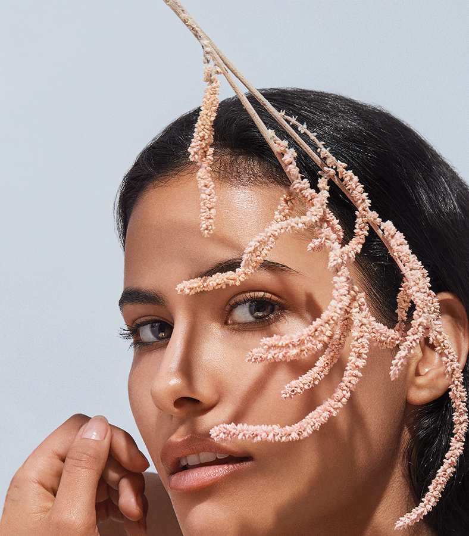
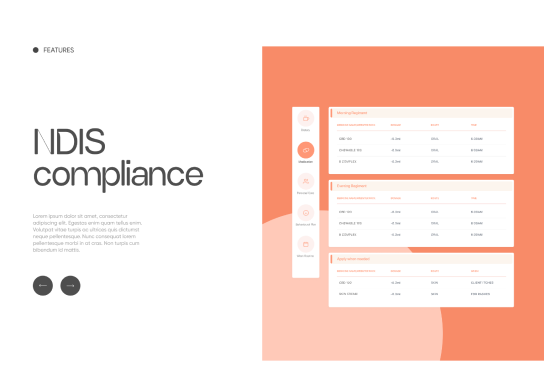
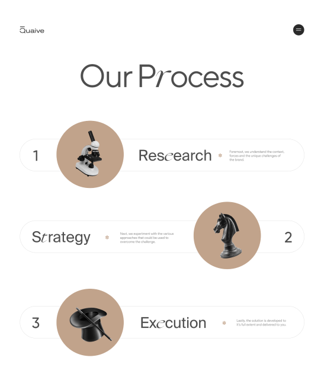
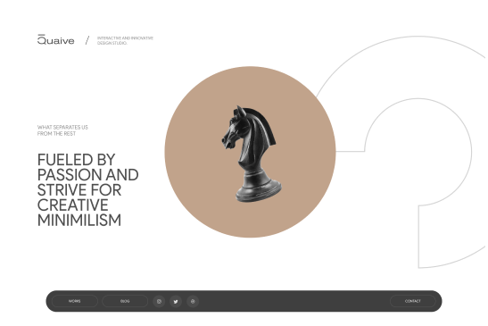

                        

                            

                                
                            

                            

                                
                            

                        

                        

                            

                                
                            

                        

                        

                            

                                
                            

                            

                                
                            

                        

                        

                            

                                

                                    

                                    

                                        <h5>behance</h5>
                                    

                                

                                

                                    
                                    
                                    
                                    
                                    
                                

                            

                        
                            

                                

                                    

                                    

                                        <h5>behance</h5>
                                    

                                

                                

                                    
                                    
                                    
                                    
                                    
                                

                            

                            

                                

                                    

                                    

                                        <h5>behance</h5>
                                    

                                

                                

                                    
                                    
                                    
                                    
                                    
                                

                            

                            

                                

                                    

                                    

                                        <h5>behance</h5>
                                    

                                

                                

                                    
                                    
                                    
                                    
                                    
                                

                            

                            

                                

                                    

                                    

                                        <h5>behance</h5>
                                    

                                

                                

                                    
                                    
                                    
                                    
                                    
                                

                            

                        
                        

                    

.cursor {
          // position: fixed;
          position: absolute;
          z-index: 99999;
          // opacity: 0;
          pointer-events: none;

          div {
            opacity: 0;
            pointer-events: none;
            width: 25vw;
            height: 18vw;
            display: flex;
            flex-direction: column;
            gap: 3%;
            transition: all cubic-bezier(0.19, 1, 0.22, 1) 1s;

            .crow {
              height: 15%;
              width: 100%;
              display: flex;
              flex-direction: row;
              align-items: center;
              gap: 0.5vw;

              .ccircle {
                height: 100%;
                width: 9%;
                border-radius: 15px;
                border: 2px solid white;
              }

              .ccapsule {
                width: 40%;
                height: 100%;
                background-color: #fff;
                border-radius: 20px;
                display: flex;
                align-items: center;
                justify-content: center;

                h5 {
                  font-size: 0.9vw;
                  font-weight: 100;
                  text-transform: uppercase;
                }
              }
            }

            .elem {
              height: 82%;
              width: 100%;
              position: relative;

              img {
                position: absolute;
                top: 0;
                left: 0;
                opacity: 0;
                width: 100%;
                animation: an 4s linear infinite;

                &:nth-child(2) {
                  animation-delay: 1s;
                }

                &:nth-child(3) {
                  animation-delay: 2s;
                }

                &:nth-child(4) {
                  animation-delay: 3s;
                }

                &:nth-child(5) {
                  animation-delay: 4s;
                }
              }
            }

            @keyframes an {
              0% {
                opacity: 1;
              }
              20% {
                opacity: 1;
              }
              21% {
                opacity: 0;
              }
              40% {
                opacity: 0;
              }
              60% {
                opacity: 0;
              }
              80% {
                opacity: 0;
              }
              100% {
                opacity: 0;
              }
            }
          }
        }

        document.querySelectorAll(".cont") .forEach(function(elem){ 
  let image;
  elem.addEventListener("mousemove", function(dets){ 
    image = dets.target;
    console.log(document.querySelector(".cursor").children[image.dataset.index])
    // document.querySelector(".cursor").children[image.dataset.index].style.opacity = 1;
    // document.querySelector(".cursor").children[image.dataset.index].style.transform = `translate(${dets.clientX}px, ${dets.clientY}px)`; 
    elem.style.filter = "grayscale(1)"; 

  })
  elem.addEventListener("mouseleave", function(dets){
    image = dets.target;
    elem.style.filter = "grayscale(0)"; 
    // document.querySelector(".cursor").children[image.dataset.index].style.opacity = 0; 
  }) 
})

console.log(document.querySelector(".cursor").children[image.dataset.index]) 